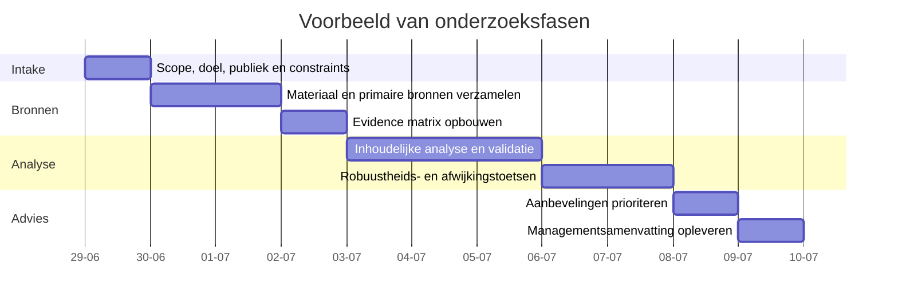

# Onderzoeksraamwerk en advies voor een nog te specificeren analysevraag

## Samenvatting

De opdracht is formeel nog ambigu: “analyseer dit, stel vragen waar nodig en kom met je advies” zegt wát er verwacht wordt, maar niet ondubbelzinnig wélk object geanalyseerd moet worden. Tegelijk is er wél een document meegestuurd, en dat document past inhoudelijk het best bij een **systeembeschrijving / onderzoeksnotitie / handelsstrategie-review**: het beschrijft een geautomatiseerd crypto-trading-systeem, specificeert de kernuitdaging rond koopregels 30 en 31, documenteert wat al is geprobeerd en vraagt expliciet om nieuwe, toetsbare invalshoeken. De primaire onderzoeksvraag in het stuk is helder: ongeveer **50% minder slechte trades** voor rules 30/31, met behoud van upside. fileciteturn0file0L3-L7 fileciteturn0file0L16-L21 fileciteturn0file0L154-L166

Als dit geüploade document inderdaad het analysemateriaal is, dan is de belangrijkste voorlopige conclusie dat de eigen analyse al vrij volwassen is: pre-entry filters lijken vijfmaal geen voorspellende kracht te hebben geleverd, meta-labeling en regime-segmentaties bleken niet robuust genoeg, en de enige bewezen verbetering tot nu toe is een iets strakkere stop-bodem. Het document zelf benoemt daarom terecht de grootste resterende blinde vlek: **NÁ-instap signalen** in de eerste minuten na entry, te gebruiken als vroege-exitlogica en niet als pre-entry selectie. Dat is op basis van het stuk de eerste route die ik zou prioriteren. fileciteturn0file0L168-L178 fileciteturn0file0L181-L208 fileciteturn0file0L216-L223

Omdat de oorspronkelijke instructie nog generiek is, geef ik hieronder een volledig intake- en onderzoeksraamwerk voor meerdere plausibele analysetypen, plus concrete adviezen voor het huidige documenttype. Voor livegang of commerciële exploitatie is bovendien een aparte **juridische/compliance-scopebepaling** nodig: in Nederland is de AFM onder MiCAR verantwoordelijk voor vergunningen en het grootste deel van het doorlopend toezicht op CASP’s, terwijl DNB prudentieel toezicht houdt op CASP’s en toezicht heeft op bepaalde stablecoin-uitgevers; tegelijk wijst DNB erop dat bij veel ongedekte crypto’s en memecoins de activakant beperkt of niet rechtstreeks onder toezicht valt. Dat maakt bronselectie en scopebepaling extra belangrijk. citeturn20view0turn19view0turn21view1

## Wat nu al vaststaat

Op basis van het meegestuurde bestand lijkt het object van analyse **geen standaard businessplan of juridisch contract**, maar eerder een technisch-analytisch dossier over een handelsstrategie. Het systeem handelt geautomatiseerd in volatiele low-cap crypto’s op 5-minuten-candles, gebruikt 11 munten en vijf indicatorreeksen, en combineert koopregels, een verkoop-engine, een regime-gate en een statistisch strenge optimalisatieketen. fileciteturn0file0L16-L21 fileciteturn0file0L25-L37 fileciteturn0file0L72-L85

De concrete bottleneck is niet dat rules 30 en 31 geen upside vinden, maar dat zij te veel verliezende trades genereren: hun ruwe opbrengst per trade ligt rond +0,25% à +0,26%, onder de in het document genoemde slippage-lat van ongeveer +0,30% per trade. De winsten lijken geconcentreerd in een kleine overlap-subset, terwijl het merendeel van de “pure” 30/31-signalen dun of verliesgevend is. fileciteturn0file0L137-L150 fileciteturn0file0L154-L178

Dat onderscheid is analytisch belangrijk. Het stuk stelt namelijk dat circa 92–93% van de 30/31-trades “puur” is, maar dat juist die pure trades de dunne, verliesgevende massa vormen, terwijl de winst in ongeveer 8% overlap-trades zit. Daardoor is een klassieke filter-oplossing vóór instap waarschijnlijk zwak, tenzij die filter specifiek iets zegt over het **vroege pad ná instap**. Dat sluit logisch aan op de eigen observatie dat de uitkomst vooral door prijsbeweging na entry wordt bepaald. fileciteturn0file0L168-L178

Hieronder behandel ik de opdracht daarom in twee lagen: eerst een generiek onderzoeksraamwerk voor het geval het object toch iets anders blijkt te zijn, daarna een concreet adviespad voor het geüploade trading-document.

## Mogelijke analysetypen en verhelderingsvragen

De eerste stap is altijd een snelle typebepaling. In dit geval past het huidige document het best in de categorie **product/systeem** of **onderzoeksnotitie**, maar de onderstaande intake voorkomt dat er langs het verkeerde beoordelingskader wordt gewerkt.

| Mogelijk object | Waaraan je het herkent | Minimale extra input | Verhelderingsvragen |
|---|---|---|---|
| Businessplan | Markt, verdienmodel, aannames, go-to-market | financieel model, marktgegevens, doelgroepdefinitie | Wat is de doelgroep? Welke omzet- en margedoelen? Wat is de investeringshorizon? |
| Rapport / managementnotitie | Samenvattingen, claims, conclusies, aanbevelingen | brondata, bijlagen, auteur, datum, doelpubliek | Moet ik feitelijk toetsen, logisch herstructureren, of beleidsmatig adviseren? |
| Dataset | Tabellen, schema’s, meetreeksen, variabelen | data dictionary, extractiebron, sample, updatefrequentie | Wat is de eenheid van observatie? Waar kunnen missings of duplicates ontstaan? |
| Beleid / procedure | Rollen, controls, uitzonderingen, escalaties | huidige policy, processen, incidenten, auditbevindingen | Wat is bindend beleid en wat is praktijk? Voor welk rechtsgebied geldt het? |
| Product / systeem | specificaties, architectuur, flows, KPI’s, incidenten | systeemdocumentatie, code/config, logs, metrics | Wat is de gewenste uitkomst: performance, betrouwbaarheid, compliance of schaalbaarheid? |
| Juridisch document | definities, rechten, verplichtingen, clausules | contract/policy, toepasselijk recht, risicopunten | Wil je een begrijpelijke uitleg, risicoanalyse of onderhandeladvies? |
| Onderzoekspaper / technische notitie | hypothesen, methoden, validatie, beperkingen | paper, data, experimentlog, reviewcriteria | Moet ik methodologische kwaliteit, reproduceerbaarheid of praktische toepasbaarheid beoordelen? |
| Overig handelsstrategie-dossier | signalen, entry/exit, backtests, statistiek, risicokaders | trades, backtests, code, kosten/slippage-aannames | Welke economie telt: bruto, netto na kosten, of live-uitvoerbaarheid? |

Voor het meegezonden bestand zijn dit de belangrijkste **aanvullende vragen** die ik alsnog expliciet zou stellen, omdat ze de kwaliteit van het uiteindelijke advies sterk bepalen:

| Voor dit trading-document ontbreekt nog | Waarom het belangrijk is |
|---|---|
| Netto resultaten inclusief fees, slippage en eventuele fill-failures | Het document werkt nu met ruwe cijfers en een eigen slippage-lat; voor live-advies moet netto-economie leidend zijn. fileciteturn0file0L148-L150 |
| Volledige trade-distributies per rule en per coin | Gemiddelden verbergen tail-risk, concentratie en regime-afhankelijkheid. |
| MAE/MFE per trade en per eerste 1–3 candles na entry | Nodig om de ongeteste post-entry-exitroute goed te ontwerpen. fileciteturn0file0L216-L219 |
| Exacte definitie van fill, signal price en simulatie van execution | Cruciaal om look-ahead en execution bias uit te sluiten. fileciteturn0file0L54-L56 fileciteturn0file0L79-L85 |
| Volledige lijst van alle geteste varianten en p-waardecorrecties | Nodig om multiple-testing-discpline echt te beoordelen. fileciteturn0file0L116-L123 |
| Code/config van sell-engine en regime-gate | Noodzakelijk om causaliteit, leakage en parameterinteracties te testen. fileciteturn0file0L89-L98 fileciteturn0file0L102-L106 |

## Onderzoeksaanpak en bronnen

De praktisch beste aanpak is een **evidence-first traject** in zes fasen. Dat voorkomt dat er te vroeg inhoudelijk advies wordt gegeven op basis van een verkeerd objecttype of onvolledige data.

| Fase | Doel | Kernoutput |
|---|---|---|
| Intake en scope | Vaststellen wat precies geanalyseerd wordt | objecttype, onderzoeksvraag, besliscriteria |
| Broninventarisatie | Primaire bronnen verzamelen en rangschikken | bronlijst met prioriteit en hiaten |
| Feitenextractie | Claims, definities, metrics en aannames uitschrijven | evidence matrix |
| Analyse | Passende kaders toepassen | bevindingen per thema |
| Validatie | Check op leakage, missing data, inconsistenties en bias | vertrouwensniveau per bevinding |
| Advies | Prioriteren op impact, snelheid en uitvoerbaarheid | aanbevelingen en next steps |

Voor dit soort opdrachten hanteer ik de volgende **bronnenvolgorde**, met een voorkeur voor primaire en Nederlandstalige bronnen waar mogelijk:

| Prioriteit | Brontype | Voorbeelden |
|---|---|---|
| Hoogst | Origineel analysemateriaal | het geüploade document, code, configuratie, dataset, exports, change logs |
| Hoog | Interne primaire data | SQL-tabellen, experimentlogs, dashboards, incident- of trade-overzichten |
| Hoog | Officiële Nederlandse toezichts- en registerbronnen | AFM, DNB, openbare registers, sectorpagina’s citeturn20view0turn19view0turn17view0 |
| Hoog | Officiële EU-wet- en regelgeving | MiCAR / EUR-Lex via de officiële verwijzingen op AFM- en DNB-pagina’s citeturn20view0turn19view0 |
| Middel | Technische of wetenschappelijke primaire bronnen | gepubliceerde papers, methodologie-notes, standards |
| Middel | Onafhankelijke secundaire duiding | alleen als context, niet als basis voor kernconclusies |
| Laag | Marketingmateriaal / meningen / samenvattingen | alleen ter verificatie van positionering of claims |

Als het geüploade bestand de echte analysetekst is, dan is het minimale onderzoekssetje voor een goede review: het document zelf, read-only toegang tot `coin_fires`, `indicators`, `rules`, `coin_regime`, en de mogelijkheid om sell-uitkomsten opnieuw te berekenen zonder de volledige historie te refiren. Dat staat ook expliciet zo in het document. fileciteturn0file0L256-L259

Voor AI-gedreven documenten of modellen voeg ik aanvullend een governance-laag toe op basis van NIST’s AI Risk Management Framework, dat expliciet bedoeld is om risico’s rond het ontwerp, gebruik en de evaluatie van AI-systemen beheersbaar te maken. Dat is vooral relevant als het “te analyseren object” een model, agent of AI-product blijkt te zijn. citeturn3view3

## Analysekaders, metriek en validatie

### Analysekaders per documenttype

| Documenttype | Primair analysekader | Secundair kader | Belangrijkste metrics |
|---|---|---|---|
| Businessplan | marktlogica + unit economics | SWOT + scenarioanalyse | CAC, LTV, brutomarge, cash runway, break-even |
| Rapport / notitie | claim-evidence matrix | stakeholderanalyse | juistheid, volledigheid, consistentie, bruikbaarheid |
| Dataset | data quality review | proces- en lineage-analyse | completeness, validiteit, duplicates, gaps, outliers |
| Beleid / procedure | control design review | risicoanalyse | eigenaarschap, escalatiepad, uitzonderingen, audit trail |
| Product / systeem | systeemdoel vs. gerealiseerde KPI’s | risico- en faalmodusanalyse | performance, betrouwbaarheid, latency, foutmarges |
| Juridisch document | rechten/plichten/risico’s | compliance-checklist | definities, aansprakelijkheid, beëindiging, datagebruik |
| Onderzoekspaper | methodologische validatie | reproduceerbaarheid | hypothesehelderheid, sample, out-of-sample, bias |
| Handelsstrategie-dossier | expectancy + robuustheid | regime-, coin- en execution-analyse | netto expectancy, MAE/MFE, win/loss mix, slippage, stability |

Voor het huidige document zou ik niet beginnen met een generieke SWOT als hoofdraamwerk. Een beter primair kader is hier een **claim–evidence–test matrix**: per veronderstelling noteren wat de claim is, welke data hem ondersteunt, welke tegenhypothese plausibel is, en welke toets dat kan falsifiëren. Het document leent zich daar goed voor, omdat de auteurs hun hypotheses, eerdere experimenten en open vragen al opvallend expliciet hebben vastgelegd. fileciteturn0file0L181-L208 fileciteturn0file0L230-L253

### Metriek voor het geüploade trading-document

Voor rules 30/31 zou ik de evaluatie **verleggen van gemiddelde winst per trade naar een compacter kwaliteitsdashboard**:

- netto expectancy per trade na fees en slippage  
- aandeel verliezers, maar ook gemiddelde verliesdiepte  
- MAE en MFE per trade  
- “flip-cost”: hoeveel winnaars worden door een nieuwe exit kapotgesneden  
- pure 30/31 versus overlap-trades  
- coin-by-coin stabiliteit  
- regime-by-regime stabiliteit  
- aandeel `is_executed` versus shadow-signalen  
- sensitivity naar eerste 1, 2 en 3 candles na instap  

Die verschuiving is logisch omdat het document zélf laat zien dat de gemiddelde opbrengst van 30/31 te dun is, dat overlap-trades economisch anders zijn dan pure trades, en dat de bestaande statistische discipline al sterk genoeg is om nieuwe varianten streng te beoordelen. fileciteturn0file0L75-L85 fileciteturn0file0L137-L150 fileciteturn0file0L172-L178 fileciteturn0file0L116-L123

### Validatie en omgaan met ontbrekende data

De eigen validatielat in het document is inhoudelijk sterk: aparte tijd-holdout, permutation/sign-flip, Šidák-correctie en voor zwaardere zoektochten CPCV/PBO/Deflated Sharpe. Die discipline zou ik behouden en alleen aanvullen met twee praktische regels: **preregistreer** de eerstvolgende testfamilies, en houd per test expliciet een foutlogboek bij met alle varianten die níet significant bleken. fileciteturn0file0L116-L123

Voor missende of twijfelachtige data zou ik bij een tijdreeksanalyse standaard dit protocol gebruiken:

1. timestamp-integriteit controleren op gaps, overlaps en duplicate candles;  
2. ontbrekende waarden labelen naar oorzaak in plaats van direct imputeren;  
3. indicatoren die afhankelijk zijn van historie opnieuw opbouwen rond missings;  
4. geen forward-fill toepassen over entry/exit-beslissingen zonder gevoeligheidsanalyse;  
5. bevindingen altijd rapporteren met een **confidence label**: hoog, redelijk, laag.

Dat advies sluit aan op het document, waarin een `missingdata`-check expliciet onderdeel van de rule-engine is en waarin read-only toetsing vanuit databasebronnen mogelijk is. fileciteturn0file0L54-L56 fileciteturn0file0L256-L259

## Advies en vervolgstappen

### Als het huidige document inderdaad het object van analyse is

Mijn eerste advies zou **niet** zijn om nóg een pre-entry filterfamilie te zoeken. Jullie eigen resultaatendossier maakt dat momenteel de minst waarschijnlijke route. Mijn eerste drie prioriteiten zouden deze zijn:

| Prioriteit | Aanbeveling | Waarom dit nu eerst |
|---|---|---|
| Hoog | Test een familie van **post-entry vroege-exits** op basis van de eerste 1–3 candles na instap | Dit is de grootste expliciet overgebleven blinde vlek en sluit direct aan op de geformuleerde probleemstructuur. fileciteturn0file0L216-L219 fileciteturn0file0L237-L242 |
| Hoog | Splits alle evaluaties in **pure 30/31** versus **overlap-trades** | Het document laat zien dat deze economisch totaal verschillende populaties zijn; zonder die scheiding loop je kans op misleidende gemiddelden. fileciteturn0file0L172-L178 |
| Middel | Doe een fijnmazige sweep van `min_sl1` in 0,993–0,996 met flip-cost rapportage | Jullie document noemt dit zelf als nog niet volledig onderzocht, terwijl het enige bewezen effect juist uit die hoek kwam. fileciteturn0file0L184-L187 fileciteturn0file0L223-L224 |

Concreet zou ik voor die eerste prioriteit drie toetsbare hypothesefamilies definiëren:

- **scratch-exit**: sluit de trade als de eerste 1–2 candles onvoldoende follow-through laten zien;  
- **micro-break-even regime**: trek de stop sneller op als vroege winst wel verschijnt maar direct terugvalt;  
- **asymmetrische early-loss cut**: gebruik strengere vroege exits alleen op pure 30/31-trades, niet op overlap-trades.

De reden is economisch, niet alleen statistisch: het dossier zegt zelf dat het probleem vooral in de verliesmassa zit en dat de goede trades hun upside al laten zien. Dan moet de nieuwe logica primair ontworpen worden om **verliesmassa te verkleinen zonder overlap-winnaars kapot te maken**. fileciteturn0file0L156-L166 fileciteturn0file0L172-L178

Mijn tweede inhoudelijke advies is om de doelstelling iets scherper te formuleren. “50% minder slechte trades” is een begrijpelijk doel, maar economisch zou ik de hoofd-KPI herdefiniëren als: **slippage-adjusted expectancy omhoog, met expliciete bovengrens voor winnaars die je opoffert**. Het document stelt zelf de vraag of het huidige doel wel het juiste doel is; die twijfel vind ik terecht. fileciteturn0file0L247-L253

Mijn derde advies is organisatorisch: behandel rules 30/31 voorlopig als een **aparte laag** in het portfolio, niet als simpelweg “nog twee buy-rules”. Het document suggereert al dat hun economische waarde vooral ligt in vroeg instappen op sterke bewegingen die soms later ook door 20–23 worden bevestigd. Dat past beter bij een laag met eigen risico- en exitlogica dan bij een uniforme rulefamilie. fileciteturn0file0L156-L178

### Generieke aanbevelingen per plausibel documenttype

| Type | Eerste advies | Concrete next step |
|---|---|---|
| Businessplan | toets aannames vóór stijl en storytelling | valideren van markt, prijs, marge, distributie en cash |
| Rapport / notitie | maak een claim-evidence matrix | markeer onbewezen claims, bronhiaten en logische sprongen |
| Dataset | voer eerst data quality audit uit | schema, missings, duplicate keys, outliers, lineage |
| Beleid / procedure | toets uitvoerbaarheid en governance | controle-eigenaar, uitzonderingspad, audit trail |
| Product / systeem | toets doel-MVP-KPI-fit | faalmodi, metrics, incidenten, monitoring |
| Juridisch document | identificeer asymmetrische risico’s | aansprakelijkheid, beëindiging, IP, data, rechtskeuze |
| Onderzoekspaper | toets methodologische robuustheid | hypothese, design, sample, validity threats |
| Handelsstrategie-dossier | toets netto-economie en robuustheid | execution, leakage, costs, regime/coin stability |

## Sjablonen en benodigde input

### Checklist van stukken en data om aan te leveren

| Categorie | Verplicht | Gewenst |
|---|---|---|
| Basismateriaal | hoofddocument, link of bestand | bijlagen, eerdere versies, change log |
| Doel en context | beoogde beslissing, doelgroep, deadline | eerdere feedback, politiek/organisatorisch krachtenveld |
| Data | ruwe data of extract | data dictionary, query’s, updatefrequentie |
| Techniek | code/config/systeemplaat | testlogs, monitoring, incidenthistorie |
| Financieel | KPI’s, aannames, kosten | cohortdata, sensitiviteitsanalyses |
| Juridisch/compliance | toepasselijk recht, policy’s, uitzonderingen | correspondentie toezichthouder, interne memo’s |
| Voor dit trading-dossier | `coin_fires`, `indicators`, `rules`, `coin_regime` | sell-engine parameters, slippage-aanname, experimentlogboek fileciteturn0file0L256-L259 |

### Interview- en vragenlijst voor stakeholders

Gebruik voor elk gesprek deze vaste set, en voeg daarna typespecifieke vragen toe:

| Vraag | Doel |
|---|---|
| Wat is de beslissing die deze analyse moet ondersteunen? | voorkomt vrijblijvende analyse |
| Wat mag absoluut niet misgaan? | maakt risico’s expliciet |
| Welke bron vertrouw jij het meest en waarom? | prioriteert bewijs |
| Waar zit volgens jou de grootste onzekerheid? | versnelt focus |
| Welke eerdere analyses of discussies zijn al gedaan? | voorkomt doublures |
| Wat is de deadline en wie is het publiek? | bepaalt detailniveau |
| Wat is vertrouwelijk of juridisch gevoelig? | bepaalt verwerkingsvorm |

Voor het huidige trading-document komen daar deze vier extra vragen bovenop:

| Extra vraag voor dit dossier | Waarom |
|---|---|
| Wat zijn de echte netto resultaten na execution assumptions? | bruto is hier onvoldoende |
| Hoe ziet MAE/MFE eruit in de eerste 15 minuten na instap? | direct relevant voor vroege-exit ontwerp |
| Welke experimenten zijn exact geprobeerd maar niet gedocumenteerd? | nodig voor multiple-testing context |
| Is live-doelstelling proprietary trading, dienstverlening of productisering? | bepaalt AFM/DNB-compliance pad citeturn20view0turn19view0 |

### Kort rapporttemplate

**Titel**  
Kernanalyse van `[object]` voor `[doelgroep]`

**Managementsamenvatting**  
Wat is het object, wat zijn de 3 hoofdbevindingen, wat is het hoofdadvies, wat is het grootste resterende risico?

**Context en scope**  
Wat is geanalyseerd, wat niet, welke bronnen zijn gebruikt?

**Feitenbasis**  
Belangrijkste claims, data of clausules met bronverwijzing.

**Analyse**  
Bevindingen per thema: inhoudelijk, financieel, operationeel, juridisch, data/validatie.

**Risico’s en onzekerheden**  
Wat weten we niet, wat kan de conclusie doen kantelen?

**Advies**  
Geprioriteerde aanbevelingen: nu, binnenkort, later.

**Bijlagen**  
Bronnenlijst, aannames, logboek, open punten.

### Voorbeeld van een executive summary

> Het meegestuurde document beschrijft een geautomatiseerd crypto-trading-systeem voor volatiele low-cap tokens op 5-minuten-candles. De kernuitdaging is dat koopregels 30 en 31 wel upside vinden, maar te veel verliezende trades genereren om na kosten overtuigend live-waardig te zijn. Eerdere onderzoeken vonden geen robuuste pre-entry features die winnaars van verliezers scheiden; de enige bewezen verbetering tot nu toe was een iets strakkere stop-bodem. Daarom ligt de hoogste prioriteit niet bij nóg een instapfilter, maar bij read-only getoetste post-entry trade-managementlogica — met name vroege-exits op basis van de eerste minuten na instap, gescheiden geëvalueerd voor pure 30/31-trades versus overlap-trades. fileciteturn0file0L16-L21 fileciteturn0file0L154-L166 fileciteturn0file0L168-L178 fileciteturn0file0L181-L208 fileciteturn0file0L216-L223

### Wat ik van je nodig heb om de echte analyse te doen

Gelieve één keer compact aan te leveren of te bevestigen:

| Nodig | Wat ik van je wil |
|---|---|
| Te analyseren object | bevestig of het geüploade rule-30/31-document inderdaad het object is |
| Doel van de analyse | besluitvoorbereiding, second opinion, investeringsbeslissing, compliance, livegang, herschrijven |
| Doelgroep | founder, MT, investeerder, jurist, technisch team, toezichthouder |
| Scope | alleen inhoud, of ook financiëel, juridisch, technisch, data, uitvoering |
| Deadline | harde datum en gewenste diepgang |
| Vertrouwelijkheid | intern, beperkt delen, juridisch gevoelig, anonimisering vereist |
| Extra materiaal | code, data, contracten, bijlagen, eerdere feedback |
| Gewenste output | memo, slides, beslisnotitie, due-diligence review, executive summary |

Als het geüploade bestand **wel** het echte analysemateriaal is, dan is de snelste vervolgstap: lever de relevante extracts van `coin_fires`, `indicators`, `rules`, `coin_regime`, plus de actuele sell-engine-config en netto kostenaanname aan. Dan kan de vervolgreview direct van intake naar inhoudelijke toetsing gaan. fileciteturn0file0L256-L259